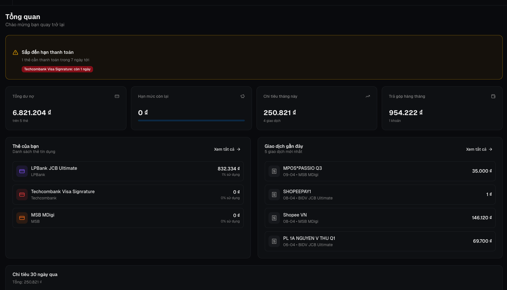
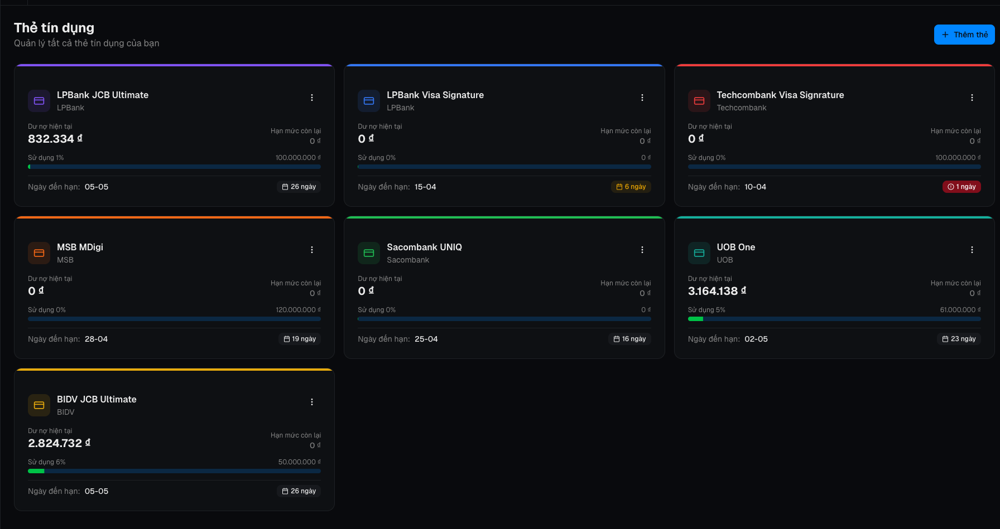
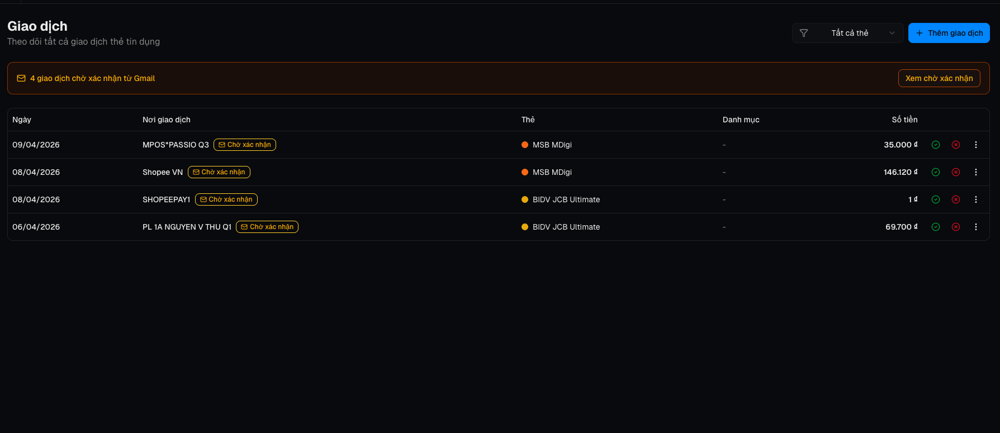
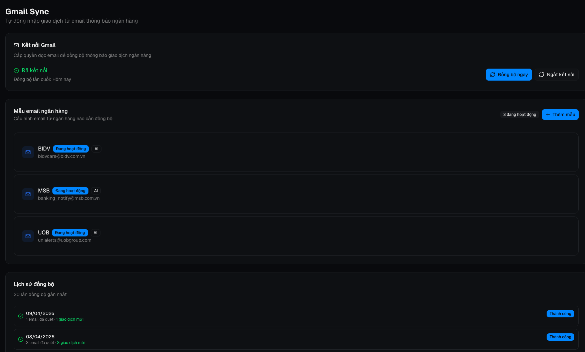
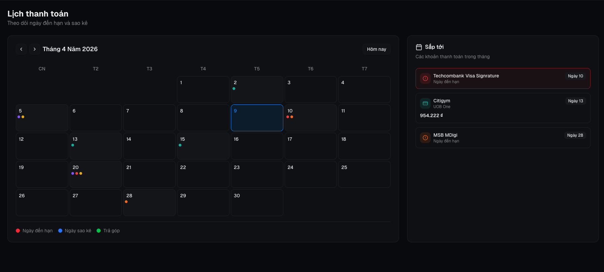
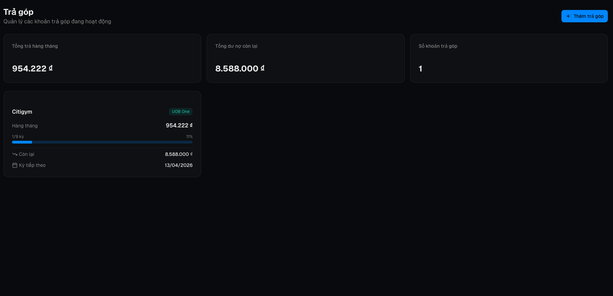

# Quản Lý Thẻ Tín Dụng Cá Nhân

Ứng dụng giúp bạn theo dõi toàn bộ thẻ tín dụng, chi tiêu, và các khoản trả góp — tất cả ở một nơi, không cần mở nhiều app ngân hàng.

---

## Ứng dụng làm được gì?

### Tổng quan tài chính
Ngay khi đăng nhập, bạn thấy ngay toàn bộ tình hình: tổng dư nợ, hạn mức còn lại, chi tiêu tháng này, và cảnh báo nếu sắp đến hạn thanh toán.

---

### Quản lý nhiều thẻ cùng lúc
Thêm tất cả thẻ tín dụng của bạn — từ LPBank, BIDV, MSB, Techcombank, UOB, Sacombank... Mỗi thẻ hiển thị dư nợ hiện tại, hạn mức, ngày đến hạn và màu cảnh báo (xanh / vàng / đỏ) để bạn biết thẻ nào cần thanh toán gấp.

---

### Theo dõi giao dịch tự động qua Gmail
Ứng dụng đọc email thông báo giao dịch từ ngân hàng trong Gmail của bạn và tự động nhập vào danh sách giao dịch. Bạn chỉ cần xác nhận hoặc bỏ qua — không cần nhập tay.

---

### Kết nối Gmail dễ dàng
Chỉ cần đăng nhập Google một lần, ứng dụng sẽ tự quét email từ các ngân hàng bạn cấu hình (BIDV, MSB, UOB...) và đồng bộ giao dịch về cho bạn kiểm tra.

---

### Lịch thanh toán trực quan
Xem toàn bộ ngày đến hạn, ngày sao kê của từng thẻ trên lịch theo tháng — không bao giờ quên thanh toán nữa.

---

### Quản lý trả góp
Theo dõi các khoản trả góp đang chạy: còn bao nhiêu kỳ, mỗi tháng phải trả bao nhiêu, kỳ tiếp theo là ngày nào.

---

## Quyền riêng tư & Bảo mật

Ứng dụng này được xây dựng cho **mục đích cá nhân** — chỉ bạn mới thấy dữ liệu của mình. Dưới đây là những điều quan trọng về bảo mật:

### Dữ liệu của bạn ở đâu?
- Tất cả dữ liệu (thẻ, giao dịch, trả góp...) được lưu trên **Supabase** — một nền tảng cơ sở dữ liệu bảo mật, không ai khác có thể truy cập dữ liệu của bạn.
- Mỗi người dùng chỉ thấy **dữ liệu của chính mình**, được bảo vệ bằng chính sách bảo mật cấp hàng (Row Level Security).

### Quyền Gmail
- Ứng dụng chỉ yêu cầu quyền **đọc email** (`gmail.readonly`) — **không thể gửi email, xóa email, hay thay đổi bất cứ thứ gì** trong hộp thư của bạn.
- Ứng dụng chỉ đọc email từ các địa chỉ ngân hàng mà **bạn tự cấu hình** (ví dụ: `bidvcare@bidv.com.vn`).
- Token Gmail được mã hóa và lưu trữ an toàn, không ai khác (kể cả nhà phát triển) có thể đọc được.

### Đăng nhập bằng Google
- Ứng dụng dùng **Google OAuth** để đăng nhập — bạn không cần tạo mật khẩu mới. Google xác thực danh tính của bạn và ứng dụng không bao giờ nhìn thấy mật khẩu Google của bạn.

### Dữ liệu có bị chia sẻ không?
- **Không.** Dữ liệu của bạn không được chia sẻ với bên thứ ba, không được dùng cho quảng cáo, không được phân tích tập thể.
- Đây là ứng dụng cá nhân — chỉ bạn dùng, chỉ bạn thấy.

---

## Cách bắt đầu

1. Truy cập ứng dụng và đăng nhập bằng tài khoản Google
2. Thêm các thẻ tín dụng của bạn vào mục **Thẻ tín dụng**
3. *(Tùy chọn)* Kết nối Gmail để tự động đồng bộ giao dịch từ email ngân hàng
4. Xem tổng quan tài chính trên trang **Tổng quan**

---

*Ứng dụng sử dụng đơn vị tiền tệ Việt Nam Đồng (₫) và định dạng ngày DD/MM/YYYY.*
